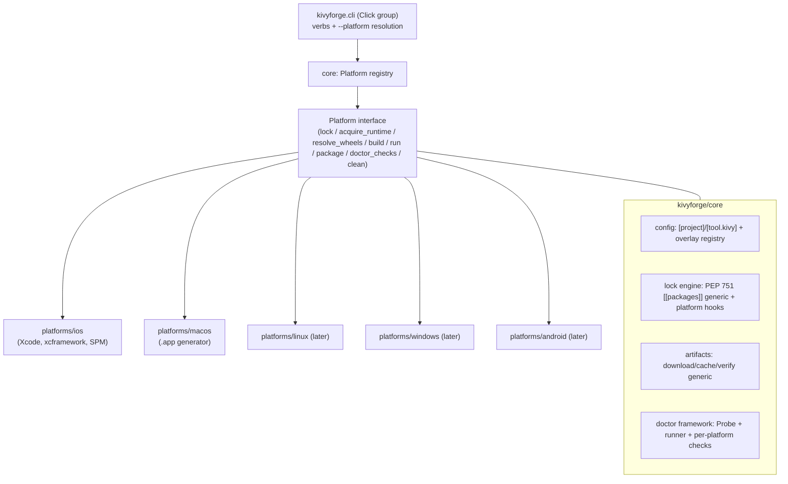

# Kivyforge Multi-Platform Extension Plan

Extend kivyforge from iOS-only to a multi-platform build toolchain (macOS, Linux, Windows, Android), starting with documentation, then a rename + modularization refactor, then one platform per phase with a review stop between each.

## Locked design decisions

- **Architecture:** rename Python package `kivy_ios` -> `kivyforge`; split into `kivyforge/core/` (shared) + `kivyforge/platforms/<platform>/` backends behind a `Platform` interface and registry.
- **Rename scope (full):** package dir, all imports, console script (`toolchain` -> `kivyforge` + `kf` alias), tests, CI, cache path, lock extension `[tool.kivy_ios]` -> `[tool.kivyforge]`, lock metadata key `toolchain_version` -> `kivyforge_version`, env vars, C bootstrap symbols, and all `toolchain <verb>` references in docs/README/FAQ/CHANGELOG/example READMEs (~370 refs across 23 markdown files).
- **CLI command name:** the console script is renamed from `toolchain` to **`kivyforge`** (command == package, per `ruff`/`uv`/`pdm` convention) with a short alias **`kf`** (two `[project.scripts]` entries -> same `main`). `toolchain` is **dropped** entirely (unreleased, clean break). `kf` conflict surface is low: no standard/Unix `kf`, no common PyPI `kf` script; the only real-world `kf` is Google Cloud's Kf CLI (niche, manually installed Go binary, different audience), and our alias installs per-venv.
- **CLI:** verb-first; platform chosen via `--platform` (with `-p` alias), uniform across all platform-aware verbs, validated with `click.Choice`. Add a `package` verb for distributables with a format slot (`-f`), keeping `build`/`run` for the dev loop. macOS supports `-f app` only for now.
- **Platform resolution chain:** `--platform/-p` argument > `KIVYFORGE_PLATFORM` env var > host platform (if configured). If the resolved host platform is not configured, **error with an actionable message** (no single-config auto-fallback, no interactive prompt). Target selection is separate from the host-capability check (e.g. iOS requires macOS).
- **pyproject.toml stays purely declarative/multi-platform:** one file may declare multiple `[tool.kivy.<platform>]` overlays sharing `[project]` + `[tool.kivy]`. No active-target field in the file.
- **Lockfile extension namespace:** a single brand-based `[tool.kivyforge]` table in every `pylock.<platform>.toml`; **no platform discriminator field** (the filename carries the platform, which the tool derives from the resolved target). **No legacy `[tool.kivy_ios]` detection/migration** (product has never been released). A light check that the expected platform sub-tables are present is acceptable for clear errors.
- **Scope principle (all platforms):** kivyforge **builds and signs the runnable application artifact**; wrapping it into an installer/container is **out of scope** and delegated to dedicated external tools (the docs recommend options per platform). The seam is clean: kivyforge emits the finished, signed artifact; the external tool ingests it. Signing stays with kivyforge (it must operate on the bundled binaries); only the installer/container step is external. Per-platform runnable artifacts:
  - iOS: Xcode-built app/`.ipa` (App Store submission external).
  - macOS: `.app` bundle (`.dmg`/installer external).
  - Windows: application folder + launcher `.exe` (onedir bundle; MSI/Inno/NSIS installer external).
  - Linux: **AppImage is the primary artifact and the `package` default** (`-f appimage`); the run-from-folder AppDir (`-f folder`) is the **required substrate + fallback** (no-FUSE/CI-safe path; the AppImage stage is a thin `appimagetool` wrap over the same tree, so later formats stay additive). `.deb`/`.rpm`/Flatpak stay external/deferred, revisited only on user demand (Flathub/sandboxing/immutable-distro → Flatpak; "package for my repo" → native).
  - Android: `.apk`/`.aab` is both artifact and installable unit, so producing it is in-scope (store submission external). No p4a - wheel-based + Gradle generation, buildable on Windows/macOS/Linux.
- **macOS (first new platform):** produce a `.app` bundle. `.dmg` creation is **out of scope** - users wrap the `.app` with external tools (DropDMG, `create-dmg`, `dmgbuild`). Code-signing is **ad-hoc/local-run only** for now; full code-signing + notarization + stapling is a later phase.
- **Docs:** `docs/common/` (shared) + `docs/platforms/<platform>/` (platform-specific).
- **Examples:** a `examples/cross_platform/` area for portable apps plus top-level per-platform dirs (`examples/ios/`, `examples/macos/`, ...) for platform-specific feature showcases, with `examples/wheels/<platform>/` for per-platform wheels. *(Realized layout differs: the repo settled on `examples/desktop/` + `examples/mobile/` groupings instead of `cross_platform/` + per-platform dirs — later phases build on the realized layout.)*
  - `cross_platform/` apps use **one `pyproject.toml` with shared `[project]`/`[tool.kivy]` + multiple `[tool.kivy.<platform>]` overlays**, producing a `pylock.<platform>.toml` per platform - showcasing (and integration-testing) the multi-overlay config + per-platform lock design.
  - `cross_platform/`: `hello-kivy`, `svg-explorer`, `mobile-geometry`, and `hello-world` (cross-platform toolchain canary). `ios/`: `keychain-spm`, `pyobjus-ball`, `pyobjus-deviceinfo`.
  - Overlays accrete per phase (iOS-only at Phase 2; macOS overlay + `pylock.macos.toml` added to the same `cross_platform/` apps at Phase 3, etc.).
  - `run-examples.sh` becomes platform-aware (e.g. `run-examples.sh --platform ios` runs every example that supports iOS), replacing the single global `KIVYFORGE_PLATFORM` export.
- **Platform order:** macOS -> Linux -> Windows -> Android. Stop between phases. macOS/iOS work on the current Mac; **Linux and Windows are both done on the Windows machine** (WSL2 Ubuntu for Linux, native for Windows), so the Mac -> Windows host switch happens once and covers both.

## Target architecture

- **core/config:** parse shared `[project]` + `[tool.kivy]`; each platform backend registers an overlay parser + config dataclass. `Config` holds `project`, `kivy`, and `platforms: dict[str, PlatformConfig]`. `load_config(require_platform=...)`.
- **core/lock:** generic PEP 751 `[[packages]]` resolve/read/write; platform backends supply tag selection, runtime metadata, and any extension subtables. Lockfile name `pylock.<platform>.toml`; single `[tool.kivyforge]` extension table within each (platform identified by filename, no discriminator field).
- **core/artifacts:** generic download/cache/verify; cache dir moves to `~/Library/Caches/kivyforge/` (and platform-appropriate dirs on other OSes).
- **core/cli:** Click group, verb dispatch, and the platform-resolution chain; verbs delegate to the resolved backend.
- **platforms/ios:** existing `project/` (Xcode), `xcode/`, iOS config overlay, iOS lock specifics (PEP 730 tags, `python_meta` xcframework, `spm`, `xcframework`), iOS artifact specifics (slice wheels, xcframework runtime), iOS doctor checks.

## Documentation restructure mapping (Phase 1)

The existing `docs/proposals/` RFCs completed their community-review purpose; **reframe them as design documentation** (remove RFC apparatus: "for comments" framing, `Depends on:` / `Consumed by:` / status headers, review language) and relocate under a `docs/design/` umbrella. User-friendly guides will be **derived later** from this content into a reserved `docs/guides/` area (out of scope now).

Target layout:

- `docs/design/common/`:
  - `00-overview.md` (rewritten: multi-platform vision, architecture; numbered ordering kept as a design **reading index**, not an RFC sequence)
  - `01-pyproject-kivy-spec.md` (shared `[project]` + `[tool.kivy]` + platform-overlay pattern; per-platform field tables move to platform docs)
  - `02-cli-and-platform-resolution.md` (new: verbs, `--platform`/`-p`, `KIVYFORGE_PLATFORM`, resolution chain, capability checks, `package` verb)
  - `03-lockfile-concept.md` (new/generalized: PEP 751 `pylock.<platform>.toml` pattern + `[tool.kivyforge]` extension)
  - `04-artifact-distribution.md` (generalized concepts)
  - `05-platform-architecture.md` (new: `core` + `platforms` interface/registry, how to add a platform)
  - `06-packaging-scope.md` (new: the build-and-sign-the-artifact-vs-external-installer principle, per-platform artifact table, and recommended external installer tools per platform)
- `docs/design/platforms/ios/`: current `02-pylock-ios-spec`, iOS parts of `03-artifact-distribution`, `04-recipe-triage`, `06-xcode-project-generation`, `07-swift-packages`.
- `docs/design/platforms/macos/`: new `macos-spec.md` (.app layout, Python runtime acquisition, macOS wheel resolution, `package -f app`; note `.dmg` and full notarization as out-of-scope/external with a brief outline of the later signing+notarization workstream).
- `docs/design/dev/`: spike findings (`resolver-findings`, `swift-spm-findings`) as internal notes.
- `docs/guides/`: **reserved placeholder** (short README noting guides are derived from `docs/design/`); no guide content written this phase.

## Phases

### Phase 1 - Documentation & design foundation
- Relocate `docs/proposals/` into `docs/design/common/` and `docs/design/platforms/<platform>/`, and `docs/dev/` into `docs/design/dev/`; move/split existing docs per mapping above.
- **Reframe RFCs as design docs:** remove RFC headers/status/`Depends on:`/`Consumed by:`/review language; keep the numbered ordering as a design reading index; fix cross-links and "kivy-ios 3.0" wording to kivyforge.
- Write new common design docs: platform architecture, CLI + platform resolution, generalized lockfile concept, packaging scope.
- Write the macOS spec under `docs/design/platforms/macos/`.
- Reserve `docs/guides/` (placeholder README only; user guides derived later, out of scope now).
- Update root `README.md` intro/structure and the design-docs link (`docs/proposals/00-overview.md` -> `docs/design/common/00-overview.md`).
- **Stop / review:** docs approved before any code changes.

### Phase 2 - Rename + modularization (no new platform)
- Rename `kivy_ios/` -> `kivyforge/`; update all imports, `pyproject.toml` console scripts (`kivyforge = "kivyforge.cli:main"` and `kf = "kivyforge.cli:main"`; drop `toolchain`), setuptools discovery, coverage config, and CI workflow filename/contents. Sweep every `toolchain <verb>` reference in docs/README/FAQ/CHANGELOG/example READMEs to `kivyforge <verb>` (introduce `kf` once in `docs/design/common/02-cli-and-platform-resolution.md`).
- Introduce `kivyforge/core/` and `kivyforge/platforms/ios/`; move iOS-specific modules (`project/`, `xcode/`, iOS lock/artifact/config/doctor specifics) into `platforms/ios/`; keep shared logic in `core/`.
- Define `Platform` interface + registry; wire CLI verbs to resolve a backend.
- Implement the platform-resolution chain (`--platform/-p` > `KIVYFORGE_PLATFORM` > host) with `click.Choice` and actionable errors; separate host-capability check.
- Add the `package` verb scaffold (iOS maps it to existing archive/export path).
- Rename lock extension `[tool.kivy_ios]` -> `[tool.kivyforge]` (single table, no discriminator, no legacy detection - never released), lock metadata key `toolchain_version` -> `kivyforge_version` (update `tests/lock/data/golden_pylock.ios.toml` and example `pylock.ios.toml` fixtures), env vars (`KIVY_IOS_*` -> `KIVYFORGE_*`), cache path (`~/Library/Caches/kivy-ios` -> `kivyforge`), and C bootstrap symbols/templates.
- Restructure examples: create `examples/cross_platform/` (`hello-kivy`, `svg-explorer`, `mobile-geometry`, `hello-world` - iOS overlay only for now) and `examples/ios/` (`keychain-spm`, `pyobjus-ball`, `pyobjus-deviceinfo`); move wheels to `examples/wheels/ios/`; make `examples/run-examples.sh` platform-aware (`--platform`, defaulting via the resolution chain).
- **Regression gate / stop:** full `pytest` green (coverage >= 80%), `ruff` clean, and all iOS examples still build/run on simulator unchanged.

### Phase 3 - macOS backend (.app)
- Add `[tool.kivy.macos]` overlay parsing + `MacosConfig` dataclass, including an `archs` field (list of `arm64`/`x86_64`; default `["arm64","x86_64"]` = universal2) that drives resolution.
- Implement `pylock.macos.toml` resolution: macOS Python runtime acquisition via a swappable **`RuntimeProvider`** abstraction. Use **`python-build-standalone` (PBS)** now (`PythonBuildStandaloneProvider`), normalizing to a canonical relocatable CPython layout the `.app` bundler consumes; the lock's `[tool.kivyforge]` records `provider` + `version` + per-artifact `url`/`sha256`. Resolve wheels for every arch in `archs` (accepting a `universal2` wheel for either); a dep missing a required arch is a fail-fast at lock. PBS ships per-arch macOS builds, so `lipo`-merge arm64 + x86_64 for a universal2 `.app`; `build`/`run`/`package` take an `--arch {arm64,x86_64,universal2}` override to assemble a subset of the locked archs for the dev loop (mirrors iOS `--device`/`--simulator`). Architect for an easy switch to a future `PythonOrgFrameworkProvider` (official relocatable framework: cpython#86680 / prebuilt-cpython) - default flips with no pyproject change, only a re-lock. Plus macOS wheel tag selection and the `[tool.kivyforge]` extension.
- Implement `platforms/macos` backend: `.app` bundle generator (Info.plist, bundled Python + wheels + app sources, launcher), `build`/`run` (launch the `.app`), `package -f app`, macOS `doctor` checks.
- **Ad-hoc signing (this phase):** `codesign --sign - MyApp.app`. This is the mandatory floor - arm64 (Apple Silicon) executables must be at least ad-hoc signed or the kernel refuses to run them. Gives integrity, not trust: the `.app` runs locally / when shared without a quarantine attribute, but a downloaded (quarantined) copy is Gatekeeper-blocked and needs right-click -> Open (or `xattr -dr com.apple.quarantine`). No Apple Developer account required.
- Add `[tool.kivy.macos]` overlays + `pylock.macos.toml` to the existing `examples/cross_platform/` apps (this lights up the "one pyproject, multiple pylock files" showcase), add macOS wheels under `examples/wheels/macos/`, and add `examples/macos/` for macOS-specific feature showcases.
- **New examples this phase:** create **2 additional `cross_platform/` examples** and **1 macOS-unique example** under `examples/macos/`, and verify all build and run (specific example ideas TBD when we reach this step).
- **Out of scope this phase:** `.dmg` creation (use external tools) and full code-signing + notarization (see deferred phase below).
- **Stop / review:** macOS `.app` builds and runs from a macOS example; tests green.

### Phase 3b - macOS Developer ID signing + notarization of the .app (deferred)
Follows the typical developer path (**sign + notarize + staple the app**; signing alone is insufficient since macOS 10.15). Produces a fully-trusted, self-contained `.app` that runs cleanly whether shipped as a zipped `.app` or dropped into an externally-built dmg. Deferred because it is a real workstream for a Python bundle, not a one-liner.
- Config surface under `[tool.kivy.macos.signing]` (`team_id`, `identity` = Developer ID Application, entitlements), reusing iOS signing config patterns where sensible; secure notary credential handling (app-specific password or App Store Connect API key), CI-friendly.
- **Nested, inside-out signing:** sign every bundled Mach-O (`.so`/`.dylib`/frameworks from Python + wheels like Kivy/SDL) first, then the `.app` last. This ordered deep-signing of dozens of binaries is the main complexity.
- Apply **Hardened Runtime** (`--options runtime`) + secure `--timestamp`; set entitlements as needed (e.g. `com.apple.security.cs.disable-library-validation` for loading third-party unsigned `.so`s).
- **Notarize + staple the app (Strategy 2):** zip the signed `.app` -> `xcrun notarytool submit` (submit -> poll -> report) -> `xcrun stapler staple MyApp.app`. Result: Gatekeeper trusts the app offline, and any external dmg just wraps an already-trusted app.
- Requires an Apple Developer Program membership and a Developer ID Application certificate.
- **Dmg-level signing/notarization stays external** (post-packaging step on a container kivyforge does not build). The docs include a copy-paste snippet (`codesign` -> `notarytool submit` -> `stapler staple` on the `.dmg`) for users who distribute a dmg and want it notarized too. **Optional:** a small generic "notarize + staple this file" helper usable on a `.zip`/`.dmg`/`.pkg` (mechanics are container-agnostic) - low cost, only if wanted; kivyforge still never builds dmgs.
- **Stop / review:** a notarized + stapled `.app` launches cleanly from a quarantined download on a second Mac (no dmg required).

### Phase 4 - Linux (on the Windows machine via WSL2) — ✅ COMPLETE

**Status: complete.** The Linux backend ships `lock`/`build`/`run`/`package -p
linux` (AppImage default + AppDir substrate), the `[tool.kivy.linux]` overlay,
`pylock.linux.toml`, `doctor -p linux`, and Linux overlays on the three desktop
examples, all verified on the WSL2/WSLg host. Realized-vs-designed deltas are
recorded as inline implementation notes in
[`docs/design/platforms/linux/linux-spec.md`](../../docs/design/platforms/linux/linux-spec.md).

**Detailed step-by-step plan: [kivyforge_linux_phase4.plan.md](kivyforge_linux_phase4.plan.md)** (supersedes this summary; first step there is writing `docs/design/platforms/linux/linux-spec.md`, mirroring the macOS-spec-before-implementation precedent).

- **Host:** WSL2 Ubuntu on the Windows machine (native x86_64, matches the common Linux distribution target; avoids arm64/emulation from a Mac VM). Includes first-run-on-Linux bring-up: test suite green on a Linux host (XDG cache path `~/.cache/kivyforge`), `ubuntu-latest` CI job.
- **Kivy needs OpenGL:** interactive smoke tests via WSLg (D3D12/Mesa GL, with `LIBGL_ALWAYS_SOFTWARE=1` as fallback); automated tests run headless via `xvfb-run` + software GL (or Kivy headless providers). The host contract (libGL/libEGL + X11/Wayland session, never vendored) is documented explicitly.
- `[tool.kivy.linux]` overlay (`app_id`, `glibc_floor`, `archs = ["x86_64"]` — x86_64 only this phase; aarch64 additive later), `pylock.linux.toml` via the shared wheel+runtime lock engine (PBS `x86_64-unknown-linux-gnu`, glibc ≥ 2.17 floor inherited for free; musl out of scope), Linux backend following the realized module conventions (`kivyforge/linux/`, `lock/linux/`, `cli/_linux.py`, `doctor/checks_linux.py`), doctor checks, Linux overlays + `pylock.linux.toml` on the 3 existing `examples/desktop/` apps (no new examples).
- **Artifact (decided): AppImage primary/default, folder substrate + fallback** — `package -f appimage` wraps the AppDir-shaped `-f folder` tree via a pinned `appimagetool` + **static-FUSE (type2) runtime** (no libfuse2 dependency on modern distros; `--appimage-extract-and-run` documented as the universal fallback). Generated `.desktop` + multi-size icons + `StartupWMClass` (with the SDL WM_CLASS env wired in the launcher) from `pyproject` — the Linux analog of Info.plist/.icns. Launcher is a shell-script `AppRun` (no compiled shim, hence no glibc-floor/build-container concern). Native `.deb`/`.rpm`/Flatpak stay **external/deferred** on demand signal; opt-in self-integration is a designed-but-deferred fast-follow.
- **Stop / review.**

### Phase 5 - Windows (native, same Windows machine as Phase 4)
- `[tool.kivy.windows]` overlay, `pylock.windows.toml`, Windows runtime + wheel resolution, `platforms/windows` backend, doctor checks, `examples/windows/`.
- **Runnable artifact:** application folder + launcher `.exe` (onedir bundle; the `.app` analog). Authenticode signing of the artifact (`signtool`) is in-scope with the artifact step; MSI/Inno/NSIS **installer is external** (docs recommend tools).
- **Stop / review.**

### Phase 6 - Android (no python-for-android)
Mirrors the iOS model - declarative config -> prebuilt artifacts -> generated native project -> platform toolchain - with **no on-host native compilation**, which makes Android buildable on Windows, macOS, and Linux alike.
- **No p4a.** Instead: prebuilt **Android Python runtime** (CPython Android support, PEP 738; the Android analog of `Python.xcframework`) + **PEP 738 platform-tagged Android wheels** resolved by pip (parallel to the iOS PEP 730 resolver) + **Gradle project generation** (the Android analog of the generated Xcode project).
- **p4a recipe responsibilities move out:** runtime geometry -> `kivy.mobile` (in Kivy core); Android permissions/activities -> a **standalone wheel** consumed as a normal dependency.
- `[tool.kivy.android]` overlay, `pylock.android.toml`, `platforms/android` backend, doctor checks, `examples/android/`.
- **Artifact:** `.apk`/`.aab` (artifact + installable unit; app signing in-scope; Play Store submission external).
- **Build host:** Windows, macOS, or Linux - only cross-platform tools needed on the app-dev host (JDK 17+, Android SDK, Gradle; NDK only for the wheel farm). **Testing** via the Android **emulator** (AVD; run on the native host with WHPX/virtualization, not inside WSL2) or a physical device over adb.
- **Infra dependency:** the Android wheels + Android Python runtime are produced by a separate build farm (typically Linux/macOS CI), analogous to the existing iOS wheel build; app developers consume prebuilt artifacts.
- **Stop / review.**

## Risks & notes
- Phase 2 is the highest-risk change (broad rename + structural refactor); the iOS examples + test suite are the regression gate that must stay green.
- macOS Python-runtime source is decided: `python-build-standalone` now behind a swappable `RuntimeProvider`, with a clean switch to the official python.org relocatable framework when it ships (cpython#86680 / prebuilt-cpython). The **Linux format choice is decided** (AppImage primary + folder substrate/fallback; only native `.deb`/`.rpm`/Flatpak remain deferred, gated on user demand — see [kivyforge_linux_phase4.plan.md](kivyforge_linux_phase4.plan.md)); the Windows packaging format remains deferred to its per-phase spec rather than guessed now.
- Android drops python-for-android in favor of the iOS-style model (prebuilt Android Python runtime via PEP 738 + PEP 738 wheels + Gradle project generation, no on-host compilation), which makes it buildable on Windows/macOS/Linux. It remains last due to the surrounding infra (Android wheel + runtime build farm) and Gradle/SDK integration surface.
- macOS/iOS work happens on the current Mac; Linux (WSL2) and Windows (native) are both done on the Windows machine, so the host switch happens once for Phases 4-5. Kivy's OpenGL dependency means Linux GUI verification needs WSLg or software GL, with headless (xvfb) for automated tests.