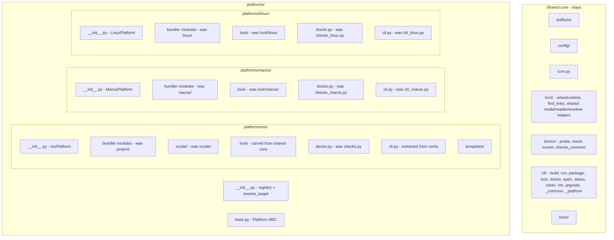

# Tier 2 Refactor — Platform-First Consolidation

Consolidate everything platform-specific under `kivyforge/platforms/<os>/` so "where is the Linux/macOS/iOS code?" is a one-package answer. The registry (`resolve_target`) and the `Platform` ABC stay at `platforms/__init__.py` / `platforms/base.py`.

This is a large, cross-cutting move, so it is staged: the already-isolated desktop backends move first (validating the target shape and giving a live Linux build early), then the shared doctor base is extracted, then the hard iOS carve-outs land, then CLI dispatch is normalized, and finally a per-host build matrix is run.

## End-state layout

## Conventions (apply throughout)

- Use `git mv` for every move (preserve history). One stage per commit.
- Inside a moved `platforms/<os>/` package: import the shared core with ABSOLUTE imports (`from kivyforge.lock.wheelruntime import ...`, `from kivyforge.doctor.checks_common import ...`), and intra-package with relative imports. This avoids relative-depth churn as files change levels.
- Keep each `platforms/<os>/__init__.py` slim (backend class + minimal re-exports). Do NOT import the bundler/lock/doctor/cli modules at package import time — the CLI dispatch imports them lazily. This prevents import cycles (registry -> backend -> bundler -> lock -> shared).
- After every stage: `ruff check kivyforge tests`, `ruff format --check kivyforge tests`, and `pytest` (coverage gate stays >=80%) on the Linux dev host. Do not proceed on red.
- Mirror test moves to `tests/platforms/<os>/` (and `tests/platforms/<os>/lock/`, `.../xcode/`).

## Shared vs per-platform boundary (the hard part, Stage 4)

Stays in `kivyforge/lock/` (consumed by macOS + Linux, so it must remain shared):
- `wheelruntime/` (whole engine), `find_links.py`
- `model.py`: `LockedWheel`, `LockedPackage`, `canonical_name`
- `reader.py`: `LockError`, `is_in_sync`, `compute_pyproject_sha256`
- `resolver.py`: the neutral pip helpers reused by `wheelruntime.resolver` (`MIN_PIP_VERSION`, `version_str`, `pip_version`)

Moves to `platforms/ios/lock/` (iOS-only):
- `builder.py` (`build_lockfile` is iOS), the iOS `PipResolver` + iOS slice logic in `resolver.py`, `spm.py`, `xcframework.py`, `python_meta.py`, `writer.py` (iOS `dumps`), and the iOS-only model/reader pieces (`Lockfile`, `PythonXcframework`, `LockedSwiftPackage`, `LockedXcframework`, iOS `load`/`loads`).

## Stages

### Stage 0 - Prep and baseline
- Commit the Tier 1 Step 1 result and this plan file (`.cursor/plans/` is git-tracked, so it travels across your platform switches).
- Establish green baseline on the Linux dev host: `ruff check`, `ruff format --check`, `pytest`.
- Optional reference: run a Linux full build now (`kivyforge lock/build/package -p linux` on `examples/desktop/desktop-viewer`) to capture a known-good pre-refactor artifact.

### Stage 1 - Move the macOS backend into `platforms/macos/`
- `git mv kivyforge/macos/*` bundler modules (`bundle.py`, `icns.py`, `launcher.py`, `machotools.py`, `notarize.py`, `plist.py`, `runtime_stage.py`, `signing.py`, `wheels_stage.py`) -> `kivyforge/platforms/macos/`.
- `git mv kivyforge/lock/macos/*` -> `kivyforge/platforms/macos/lock/` (keeps the `MacosProfile`-over-`wheelruntime` shape from [kivyforge/lock/macos/__init__.py](kivyforge/lock/macos/__init__.py)).
- `git mv kivyforge/cli/_macos.py` -> `kivyforge/platforms/macos/cli.py`.
- `git mv kivyforge/doctor/checks_macos.py` -> `kivyforge/platforms/macos/doctor.py`; move `run_macos_checks` out of [kivyforge/doctor/runner.py](kivyforge/doctor/runner.py) into that module.
- Repoint importers: `cli/lock.py` (`from ..lock import macos` -> `from ..platforms.macos.lock import ...`), `cli/doctor.py`, `cli/build.py`/`run.py`/`package.py` (`from ._macos import ...` -> `from ..platforms.macos.cli import ...`), and any `from ..lock.macos import ...` / `from ..macos... import ...` across the tree (grep-driven).
- Move tests: `tests/macos/` -> `tests/platforms/macos/`, `tests/lock/macos/` -> `tests/platforms/macos/lock/`, macOS doctor tests -> `tests/platforms/macos/`.
- Verify: `pytest` green (macOS bundler modules import cleanly on Linux; they only shell out at runtime).

### Stage 2 - Move the Linux backend into `platforms/linux/`
- Mirror Stage 1 for Linux: `kivyforge/linux/*` -> `platforms/linux/`; `kivyforge/lock/linux/*` -> `platforms/linux/lock/`; `cli/_linux.py` -> `platforms/linux/cli.py`; `doctor/checks_linux.py` -> `platforms/linux/doctor.py` + move `run_linux_checks`.
- Repoint importers (`from ..lock.linux import ...`, `from ..linux import AppDirError`, `from ._linux import ...`, doctor runner LinuxLockfile).
- Move tests: `tests/linux/`, `tests/lock/linux/` -> `tests/platforms/linux/...`.
- Verify: `pytest` green PLUS the first live per-platform build gate (we are on Linux): `kivyforge lock/build/run --? /package -p linux` on `examples/desktop/desktop-viewer` (and `examples/desktop/notes`). Compare artifact against the Stage 0 reference.

### Stage 3 - Extract the shared doctor base
- Split [kivyforge/doctor/checks.py](kivyforge/doctor/checks.py): move the platform-neutral checks reused by macOS/Linux (`check_pip_version`, `check_kivyforge_version`, `check_app_dir`, `SKIP_NOTE`, `_ver_tuple`) into new `kivyforge/doctor/checks_common.py`.
- Repoint `platforms/macos/doctor.py` and `platforms/linux/doctor.py` (from Stages 1-2) to import from `doctor.checks_common` instead of `doctor.checks`.
- Leave the iOS-specific remainder in `doctor/checks.py` for now (moves in Stage 5) and repoint its neutral imports to `checks_common`.
- Verify: `pytest` green.

### Stage 4 - Carve out the iOS lock into `platforms/ios/lock/` (highest risk)
- Apply the shared/iOS boundary above. Split `model.py`, `reader.py`, `resolver.py` into their shared remainder (stays) and iOS pieces (move). Move `builder.py`, `spm.py`, `xcframework.py`, `python_meta.py`, `writer.py` to `platforms/ios/lock/`.
- Give `platforms/ios/lock/__init__.py` an iOS public surface (`build_lockfile`, `dumps`, `load`, `loads`, `semantic_equal`, `diff_summary`, `Lockfile`, etc.), mirroring [kivyforge/lock/macos/__init__.py](kivyforge/lock/macos/__init__.py).
- Repoint importers (many): `cli/lock.py` `_lock_ops` iOS branch, `cli/build.py`, `cli/status.py`, `cli/upgrade.py`, `cli/doctor.py`, `artifacts/collect.py`, `artifacts/wheels.py`, `artifacts/download.py`, the iOS bundler (`project/materialize.py`, `project/generator.py`, `project/swift_packages.py`), and `tests/lock/*`. Consider a temporary re-export shim in `kivyforge/lock/__init__.py` to stage the churn, removed by end of stage.
- Move iOS lock tests to `tests/platforms/ios/lock/`; leave shared-core lock tests in `tests/lock/`.
- Verify: `pytest` green (iOS lock is exercised heavily by unit tests + golden files, so this stage is well-covered).

### Stage 5 - Move the iOS bundler + extract iOS CLI into `platforms/ios/`
- `git mv kivyforge/project/*` -> `platforms/ios/` (bundler modules) and `kivyforge/project/templates/` -> `platforms/ios/templates/`; `git mv kivyforge/xcode/` -> `platforms/ios/xcode/`.
- Extract the inline iOS logic from `cli/build.py`, `cli/run.py`, `cli/package.py`, `cli/open_cmd.py`, `cli/status.py` into `platforms/ios/cli.py` (functions `ios_build`, `ios_run`, `ios_package`, `ios_open`, `ios_status`), leaving each verb a thin dispatcher symmetric with macOS/Linux. Move iOS-only helpers (`prepare_build`, `_xcodebuild_step7`, `_resolve_slices`, etc.) with it.
- Move iOS `run_checks` and the remainder of `doctor/checks.py` -> `platforms/ios/doctor.py`.
- Update `MANIFEST.in` (`recursive-include kivyforge/project/templates *` -> `.../platforms/ios/templates *`) and `pyproject.toml` coverage omit (`kivyforge/project/templates/*` -> `kivyforge/platforms/ios/templates/*`).
- Move tests: `tests/project/` -> `tests/platforms/ios/`, `tests/xcode/` -> `tests/platforms/ios/xcode/`; fix `tests.test_icon` helper imports if needed.
- Verify: `pytest` green.

### Stage 6 - Normalize CLI + doctor dispatch
- With all three backends exposing `platforms/<os>/cli.py` and `platforms/<os>/doctor.py`, replace the `if backend.name == "macos"/"linux"/"ios"` chains in the verb modules and `doctor/runner.py` with a per-backend dispatch (either methods on the `Platform` subclass that lazily import the package, or a small name->callable map). This delivers the actual payoff of consolidation.
- Keep `cli/_platform.py` (target selection) shared; optionally rename to `cli/_target.py`.
- Verify: `pytest` green and coverage >=80%.

### Stage 7 - Docs + per-host build matrix (the platform-switch test phase)
- Update docs: module-layout sections in `docs/design/platforms/{ios,macos,linux}/*`, `docs/design/common/05-platform-architecture.md`, and the [kivyforge/platforms/base.py](kivyforge/platforms/base.py) docstring.
- Run the full validation matrix, switching hosts as noted. Use `examples/desktop/desktop-viewer` (configures all three platforms) as the primary target, with a simpler per-platform app as fallback:
  - Linux host: `ruff check`, `ruff format --check`, `pytest`; then `kivyforge lock -p linux`, `build -p linux`, `run -p linux` (headless via `xvfb-run` / `LIBGL_ALWAYS_SOFTWARE=1` if needed), `package -f appimage -p linux` and `-f folder`. Fallback app: `examples/desktop/notes`.
  - macOS host: `pytest`; then macOS build: `kivyforge lock -p macos`, `build -p macos`, `run -p macos`, `package -p macos`. Fallback app: `examples/desktop/dice-roller`.
  - macOS host (iOS): `kivyforge lock -p ios`, `build --simulator`, `run --simulator` (and `--device`/`package` if signing is available). Fallback app: `examples/mobile/hello-world`.
- Confirm each artifact launches. Record results in the plan checklist.

## Risks / assumptions
- iOS live build (Stage 7) needs macOS + Xcode and a published iOS Python.xcframework + wheels. [.github/workflows/kivyforge.yml](.github/workflows/kivyforge.yml) notes the live iOS smoke test is "wired in once the iOS Python.xcframework + wheels are published." Confirm the iOS example can actually build in your environment; if not, iOS validation may be limited to `build` (project generation) + unit tests rather than a launched app.
- Stage 4 is the riskiest (shared/iOS lock split). It is fully unit-tested + golden-file covered, so pytest is a strong gate; still, do it as its own commit for easy rollback.
- macOS/iOS bundler modules must remain import-safe on Linux (they already are - platform-specific behavior is runtime shell-outs) so Stages 1-6 stay gateable on the Linux dev host.