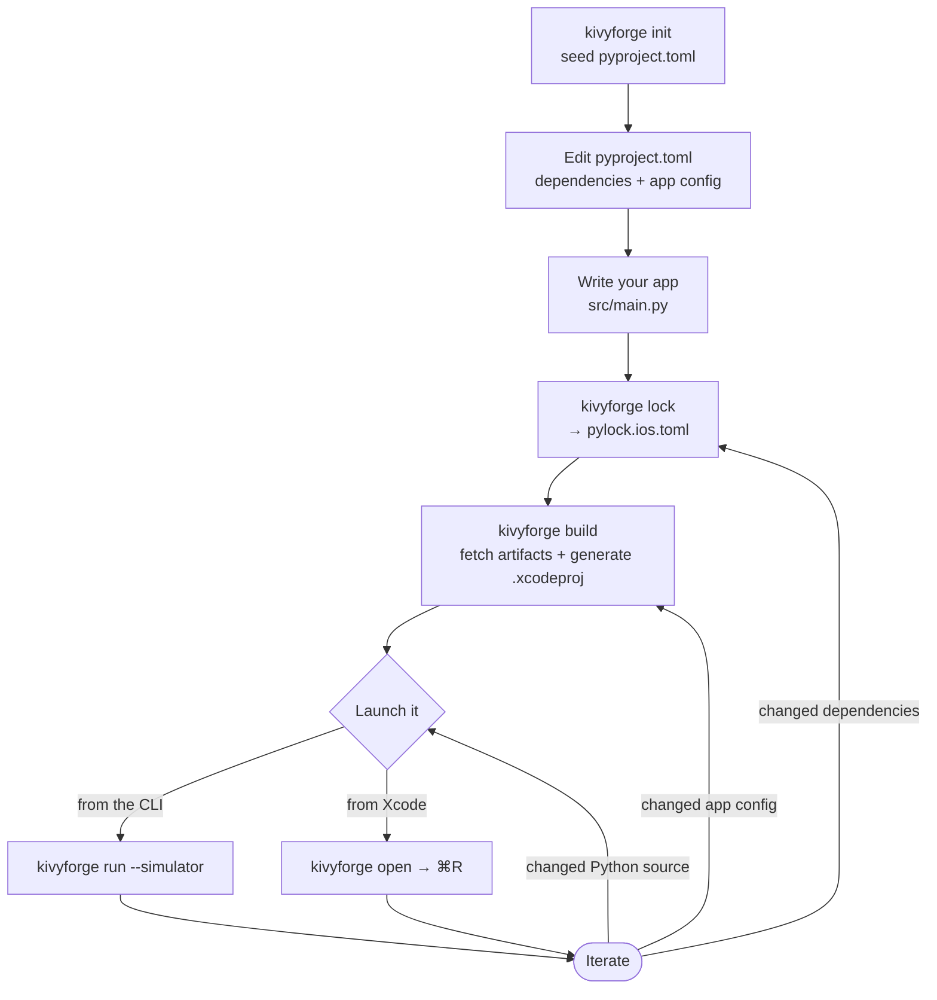

# kivyforge


[](https://opencollective.com/kivy)
[](https://opencollective.com/kivy)
[](code_of_conduct.md)


[](https://github.com/ElliotGarbus/kivyforge/actions/workflows/kivy_ios.yml)

kivyforge is a declarative, [PEP 621](https://peps.python.org/pep-0621/)-aligned
build toolchain for [Kivy](https://kivy.org) (and other Python) apps. You
describe your app once in `pyproject.toml`; kivyforge resolves your dependencies
into a lockfile and packages the app for the platform you target. It is the
successor to **kivy-ios**, **python-for-android**, and **buildozer**, unifying
their per-platform workflows behind a single declarative configuration.

The goal is one toolchain for every platform Kivy runs on — **Android, iOS,
Linux, macOS, and Windows**.

> **Status: early development — iOS first.** Today kivyforge targets **iOS**: it
> resolves dependencies into `pylock.ios.toml`, downloads the official
> [`Python.xcframework`](https://www.python.org/downloads/) plus prebuilt iOS
> wheels, and generates an [Xcode](https://developer.apple.com/xcode/) project
> ready to run on device or simulator. Android, Linux, macOS, and Windows targets
> are planned. If you need a shipping toolchain today, use kivy-ios 2.x,
> python-for-android, or buildozer.

### Currently supported targets

- [iOS](https://www.apple.com/ios/) device (arm64) — iPhone / iPad
- iOS Simulator (arm64, x86_64)

kivyforge builds on the work of the [Kivy Team](https://kivy.org/about.html).

## Requirements

Each target platform has its own host requirements. **Building for iOS requires
macOS** (Xcode-based), so the iOS workflow below is useful only on a Mac:

- macOS with [Xcode](https://developer.apple.com/xcode/) installed, either from
  the [Mac App Store](https://apps.apple.com/app/xcode/id497799835) or from the
  command line:

      xcode-select --install

- Accept the Xcode license once:

      sudo xcodebuild -license

## Installation

Use a Python virtual environment (host Python 3.13+). This is required: it
isolates the toolchain and keeps its lockfile resolution from being polluted by
packages in your system Python.

      python3 -m venv .venv
      . .venv/bin/activate

Install kivyforge from this repository (it is not yet published to PyPI):

      pip install -e ".[dev]"

> **Early-stage: build the example wheels first.** kivyforge consumes prebuilt,
> platform-tagged wheels, but Kivy's iOS wheels are not yet published to PyPI. To
> run the Kivy-based and pyobjus examples you must first cross-build the required
> `cp315` iOS wheels locally; they land in the shared
> [`examples/wheels/`](examples/wheels/) directory:
>
>       # Kivy iOS wheels — needed by every Kivy example (all except hello-world)
>       scripts/build_ios_wheels.sh
>
>       # pyobjus iOS wheels — needed by pyobjus-ball, pyobjus-deviceinfo, keychain-spm
>       scripts/build_pyobjus_ios_wheels.sh
>
> These scripts require macOS, Xcode, and network access. The pure-Python
> [`examples/hello-world`](examples/hello-world/) uses only the python.org
> `Python.xcframework` and needs no wheels.

> **Detailed documentation.** For the full design and reference docs — the
> cross-platform model, the `pyproject.toml` / `pylock.<platform>.toml` schemas,
> artifact distribution, the CLI shape, and the per-platform backends (iOS,
> macOS) — start with the
> [kivyforge design overview](docs/design/common/00-overview.md).

## Quick start (iOS)

The workflow below targets iOS — currently the only implemented platform. Run
every command from the directory that contains your app's `pyproject.toml`.

      # 1. Seed [tool.kivy] / [tool.kivy.ios] config into pyproject.toml
      kivyforge init

      # 2. Resolve dependencies into pylock.ios.toml
      kivyforge lock

      # 3. Download artifacts and generate <app>-ios/<app>.xcodeproj
      kivyforge build

      # 4a. Open the project in Xcode and press Run...
      kivyforge open

      # 4b. ...or build, install, and launch on the simulator from the CLI
      kivyforge build --simulator
      kivyforge run --simulator

See the runnable examples for complete, copy-pasteable walk-throughs:

- [`examples/hello-world`](examples/hello-world/) — pure-Python smoke test using
  the official python.org `Python.xcframework` (no Kivy, no wheels).
- [`examples/hello-kivy`](examples/hello-kivy/) — minimal Kivy UI that uses
  locally built `cp315` iOS wheels from the shared [`examples/wheels/`](examples/wheels/) directory.
- [`examples/svg-explorer`](examples/svg-explorer/) — interactive SVG viewer
  (multitouch pan/zoom/rotate) using the same shared wheels.
- [`examples/pyobjus-ball`](examples/pyobjus-ball/) — calls native iOS APIs
  (CoreMotion, UIScreen) from Python via the Objective-C runtime.
- [`examples/keychain-spm`](examples/keychain-spm/) — declares a remote Swift
  Package (`KeychainAccess`), pins it with `kivyforge lock`, and calls it from
  Python through a local `@objc` shim package.

## Configuring your app

Your app is described declaratively in `pyproject.toml`. Standard
[PEP 621](https://peps.python.org/pep-0621/) `[project]` metadata supplies the
name, version, and runtime `dependencies`; shared, platform-neutral settings live
under `[tool.kivy]`, and iOS-specific settings live under `[tool.kivy.ios]`
(other platforms will add their own `[tool.kivy.<platform>]` tables):

```toml
[project]
name = "hello-world"
version = "0.1.0"
requires-python = ">=3.15.0b2"
dependencies = []                       # PyPI/local deps resolved into the lockfile

[tool.kivy]
display_name = "Hello World"            # name shown under the icon
app_dir = "src"                         # folder containing your Python source
entry_point = "main"                    # module imported at launch (main.py)
orientation = ["portrait"]

[tool.kivy.ios]
bundle_id = "org.example.hello-world"   # reverse-DNS; UTI characters only (no underscores)
build = 1
deployment_target = "13.0"
# find_links = ["../wheels"]            # repo-relative wheel directory for lock
# exclude = ["docutils", "pygments"]    # drop transitive deps you don't use at runtime

[tool.kivy.ios.python]
version = "3.15.0b2"                     # python.org Python.xcframework version

[tool.kivy.ios.signing]
team_id = ""                            # Apple Developer Team ID (device / release builds)
identity = "Apple Development"
auto_signing = true
```

`kivyforge build` syncs your `app_dir` into the generated `<app>-ios/` tree on
every run, so make changes in your source folder (e.g. `src/`), never in the
generated project.

Kivy's wheel declares dependencies that are not all needed at runtime on iOS.
The `exclude` list trims them; the
[hello-kivy example](examples/hello-kivy/pyproject.toml) documents what each one
is for, so you can re-enable only the few that map to widgets you actually use
(e.g. `docutils` for `RSTDocument`, `pygments` for `CodeInput`, or `requests`
for `UrlRequest`).

## Commands

The verbs are platform-neutral; the descriptions and artifacts below reflect the
iOS target available today.

      kivyforge init       Seed [tool.kivy] / [tool.kivy.ios] into pyproject.toml
      kivyforge lock       Generate pylock.ios.toml from pyproject.toml
      kivyforge build      Download artifacts, generate the Xcode project, build
      kivyforge run        Build (unless --no-build), install, and launch the app
      kivyforge open       Open <app>-ios/<app>.xcodeproj in Xcode
      kivyforge status     Show app identity, Python version, lock sync, build state
      kivyforge clean      Remove generated artifacts in the project folder
      kivyforge upgrade    Re-fetch pinned Python.xcframework / xcframework artifacts
      kivyforge doctor     Run environment and project health checks

Run `toolchain <command> -h` for the full set of options on any verb. A few
common ones:

- `kivyforge lock --check` — CI pre-flight; exits non-zero if the lock is stale.
- `kivyforge build --simulator | --device | --release` — pick the build flavor.
- `kivyforge run --list-devices` — list available simulators and devices.
- `kivyforge clean --cache` — also flush the artifact download cache.

Downloaded artifacts (`Python.xcframework` and other xcframeworks) are cached
under `~/Library/Caches/kivy-ios/artifacts/` and shared across projects.

## Typical workflow

A normal session is a one-time setup followed by a tight edit → run loop.
The generated project **links** your source directory (`app/` is a symlink to
`app_dir`), so editing Python source needs no rebuild — just relaunch. You only
re-run `kivyforge lock` when dependencies change, and `kivyforge build` when you
change app config (or need to regenerate the Xcode project).



Supporting commands fit around this loop: `kivyforge status` shows whether your
lock and build are current, `kivyforge doctor` diagnoses environment problems,
`kivyforge upgrade` re-fetches the pinned runtime, and `kivyforge clean` resets
the generated project when you want a fresh build.

## Development

Clone the repository and install it into a virtual environment:

      git clone https://github.com/ElliotGarbus/kivyforge.git
      cd kivyforge/
      python3 -m venv .venv
      . .venv/bin/activate
      pip install -e ".[dev]"

Run the test suite and the linter:

      pytest
      ruff check .

## FAQ

For troubleshooting advice and other frequently asked questions, consult
the latest 
[kivyforge FAQ](https://github.com/ElliotGarbus/kivyforge/blob/master/FAQ.md).

## License

kivyforge is [MIT licensed](LICENSE), and builds on work actively developed by a
great community and supported by many projects managed by the 
[Kivy Organization](https://www.kivy.org/about.html).

## Support

Are you having trouble using kivyforge or any of its related projects in the Kivy
ecosystem?
Is there an error you don’t understand? Are you trying to figure out how to use 
it? We have volunteers who can help!

The best channels to contact us for support are listed in the latest 
[Contact Us](https://github.com/ElliotGarbus/kivyforge/blob/master/CONTACT.md) document.

## Contributing

kivyforge builds on the [Kivy](https://kivy.org) ecosystem - a large group of
products used by many thousands of developers for free, but it
is built entirely by the contributions of volunteers. We welcome (and rely on) 
users who want to give back to the community by contributing to the project.

Contributions can come in many forms. See the latest 
[Contribution Guidelines](https://github.com/ElliotGarbus/kivyforge/blob/master/CONTRIBUTING.md)
for how you can help us.

## Code of Conduct

In the interest of fostering an open and welcoming community, we as 
contributors and maintainers need to ensure participation in our project and 
our sister projects is a harassment-free and positive experience for everyone. 
It is vital that all interaction is conducted in a manner conveying respect, 
open-mindedness and gratitude.

Please consult the [latest Kivy Code of Conduct](https://github.com/kivy/kivy/blob/master/CODE_OF_CONDUCT.md).

## Contributors

This project exists thanks to 
[all the people who contribute](https://github.com/ElliotGarbus/kivyforge/graphs/contributors).
[[Become a contributor](CONTRIBUTING.md)].


## Backers

Thank you to [all of our backers](https://opencollective.com/kivy)! 
🙏 [[Become a backer](https://opencollective.com/kivy#backer)]


## Sponsors

Special thanks to 
[all of our sponsors, past and present](https://opencollective.com/kivy).
Support this project by 
[[becoming a sponsor](https://opencollective.com/kivy#sponsor)].

Here are our top current sponsors. Please click through to see their websites,
and support them as they support us. 

<!--- See https://github.com/orgs/kivy/discussions/15 for explanation of this code. -->
<a href="https://opencollective.com/kivy/sponsor/0/website" target="_blank"></a>
<a href="https://opencollective.com/kivy/sponsor/1/website" target="_blank"></a>
<a href="https://opencollective.com/kivy/sponsor/2/website" target="_blank"></a>
<a href="https://opencollective.com/kivy/sponsor/3/website" target="_blank"></a>

<a href="https://opencollective.com/kivy/sponsor/4/website" target="_blank"></a>
<a href="https://opencollective.com/kivy/sponsor/5/website" target="_blank"></a>
<a href="https://opencollective.com/kivy/sponsor/6/website" target="_blank"></a>
<a href="https://opencollective.com/kivy/sponsor/7/website" target="_blank"></a>

<a href="https://opencollective.com/kivy/sponsor/8/website" target="_blank"></a>
<a href="https://opencollective.com/kivy/sponsor/9/website" target="_blank"></a>
<a href="https://opencollective.com/kivy/sponsor/10/website" target="_blank"></a>
<a href="https://opencollective.com/kivy/sponsor/11/website" target="_blank"></a>

<a href="https://opencollective.com/kivy/sponsor/12/website" target="_blank"></a>
<a href="https://opencollective.com/kivy/sponsor/13/website" target="_blank"></a>
<a href="https://opencollective.com/kivy/sponsor/14/website" target="_blank"></a>
<a href="https://opencollective.com/kivy/sponsor/15/website" target="_blank"></a>
