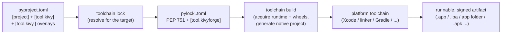

# 00 — kivyforge: Design Overview

**Audience:** kivyforge maintainers and contributors, the Kivy core team, and advanced Kivy app authors.

kivyforge is a declarative, [PEP 621](https://peps.python.org/pep-0621/)-aligned build toolchain for [Kivy](https://kivy.org) (and other Python) apps. You describe your app once in `pyproject.toml`; kivyforge resolves your dependencies into a per-platform lockfile, acquires prebuilt runtimes and wheels, materializes a native project, and drives the platform's own toolchain to produce a runnable, signed application artifact.

It is the successor to **kivy-ios**, **python-for-android**, and **buildozer**, unifying their per-platform workflows behind a single declarative configuration. The goal is one toolchain for every platform Kivy runs on — **Android, iOS, Linux, macOS, and Windows**.

> These are **design documents**, not user guides. They describe how kivyforge is intended to work and why. User-facing guides will be derived from this material later (see the reserved [`docs/guides/`](../../guides/README.md)).

## The core model

Every platform follows the same four-stage pipeline — *declarative config → resolved lock → materialized native project → platform toolchain* — differing only in the platform-specific backend that implements each stage.

1. **Declare.** One `pyproject.toml` holds standard `[project]` metadata (PEP 621), shared Kivy settings in `[tool.kivy]`, and one additive `[tool.kivy.<platform>]` overlay per target you build.
2. **Lock.** `toolchain lock` resolves `[project].dependencies` for the *resolved target*, evaluating PEP 508 markers and selecting platform-tagged wheels, and writes a PEP 751 `pylock.<platform>.toml` pinned by URL + SHA-256.
3. **Build.** `toolchain build` acquires the prebuilt Python runtime and the pinned wheels/native artifacts, then materializes the platform's native project.
4. **Produce.** The platform's own toolchain compiles, links, signs, and emits the runnable artifact.

## Design principles

- **Declarative, PEP-aligned single source of truth.** Cross-platform metadata and Python dependencies live in PEP 621 `[project]` and cross-platform `[tool.kivy]`; each target adds a `[tool.kivy.<platform>]` overlay. One file, readable by every PEP 621-compliant tool (ruff, mypy, uv, pdm, pip). See [01 — pyproject / `[tool.kivy]` spec](01-pyproject-kivy-spec.md).
- **Reproducible per-platform locks (PEP 751).** Each target produces a `pylock.<platform>.toml` whose standard `[[packages]]` section stays consumable by any PEP 751-aware installer; kivyforge's build-specific pins live in a single `[tool.kivyforge]` extension table. The **platform is identified by the filename**, not a discriminator field. See [03 — lockfile concept](03-lockfile-concept.md).
- **Consume prebuilt artifacts; run no from-source build pipeline.** kivyforge does not resurrect a recipe system or cross-compile Python C extensions. It consumes prebuilt Python runtimes and platform-tagged wheels, and defers any genuine from-source compilation to the platform's own maintained toolchain (e.g. Xcode's Swift Package Manager). See [04 — artifact distribution](04-artifact-distribution.md).
- **Clean core + platform-backend architecture.** Shared logic (config parsing, the PEP 751 lock engine, artifact download/cache/verify, the doctor framework, the CLI) lives in `core`; each platform is a backend behind a `Platform` interface and registry. See [05 — platform architecture](05-platform-architecture.md).
- **Build and sign the artifact; leave the installer to external tools.** kivyforge produces (and signs) the finished runnable artifact for each platform. Wrapping it into an installer/container (`.dmg`, MSI, `.deb`, Flatpak, store submission) is out of scope and delegated to dedicated tools. See [06 — packaging scope](06-packaging-scope.md).
- **Uniform, explicit CLI.** Verb-first commands with a uniform `--platform` / `-p` selector and a small resolution chain (`--platform` → `KIVYFORGE_PLATFORM` → host platform). See [02 — CLI + platform resolution](02-cli-and-platform-resolution.md).

## Platform status

kivyforge is in early development, added one platform at a time.

- **iOS** — implemented. Resolves `pylock.ios.toml`, downloads the official python.org `Python.xcframework` plus iOS wheels, and generates an Xcode project. Full design under [platforms/ios](../platforms/ios/pyproject-ios.md).
- **macOS** — next: produce a `.app` bundle. See [platforms/macos/macos-spec.md](../platforms/macos/macos-spec.md).
- **Linux, Windows, Android** — planned, in that order.

## Reading index

The numbers below are a **reading order for the design**, not a version or RFC sequence.

### Common (cross-platform)

| # | Document | Purpose |
|---|----------|---------|
| 00 | This document | Vision, core model, principles, reading index |
| 01 | [pyproject / `[tool.kivy]` spec](01-pyproject-kivy-spec.md) | Shared `[project]` + `[tool.kivy]` + the platform-overlay pattern |
| 02 | [CLI + platform resolution](02-cli-and-platform-resolution.md) | Verbs, `--platform`/`-p`, `KIVYFORGE_PLATFORM`, resolution chain, `package` verb |
| 03 | [Lockfile concept](03-lockfile-concept.md) | The generalized PEP 751 `pylock.<platform>.toml` + `[tool.kivyforge]` extension |
| 04 | [Artifact distribution](04-artifact-distribution.md) | Where artifacts come from, how they're verified and consumed |
| 05 | [Platform architecture](05-platform-architecture.md) | `core` + `platforms` interface/registry; how to add a platform |
| 06 | [Packaging scope](06-packaging-scope.md) | Build-and-sign-the-artifact vs. external-installer principle |

### iOS

| Document | Purpose |
|----------|---------|
| [pyproject-ios](../platforms/ios/pyproject-ios.md) | The `[tool.kivy.ios]` overlay schema |
| [pylock-ios-spec](../platforms/ios/pylock-ios-spec.md) | The iOS `pylock.ios.toml` (PEP 751 + `[tool.kivyforge]`) |
| [artifact-distribution-ios](../platforms/ios/artifact-distribution-ios.md) | iOS wheels, `.xcframework` archives, SPM |
| [cli-ios](../platforms/ios/cli-ios.md) | iOS-specific verb behavior, `doctor`, `kivy.mobile`, legacy verbs |
| [xcode-project-generation](../platforms/ios/xcode-project-generation.md) | Project layout, pbxproj wiring, Build Python phase |
| [swift-packages](../platforms/ios/swift-packages.md) | Swift Package Manager as a native-dependency channel |
| [recipe-triage](../platforms/ios/recipe-triage.md) | Disposition of the legacy kivy-ios 2.x recipes |

### macOS

| Document | Purpose |
|----------|---------|
| [macos-spec](../platforms/macos/macos-spec.md) | `.app` layout, Python runtime acquisition, macOS wheels, `package -f app`, signing outline |

### Developer notes

| Document | Purpose |
|----------|---------|
| [dev/resolver-findings](../dev/resolver-findings.md) | Phase 0 spike: pip as the iOS cross-resolution backend |
| [dev/swift-spm-findings](../dev/swift-spm-findings.md) | Phase 0 spike: linking/embedding a Swift SPM product in a pure-ObjC target |
