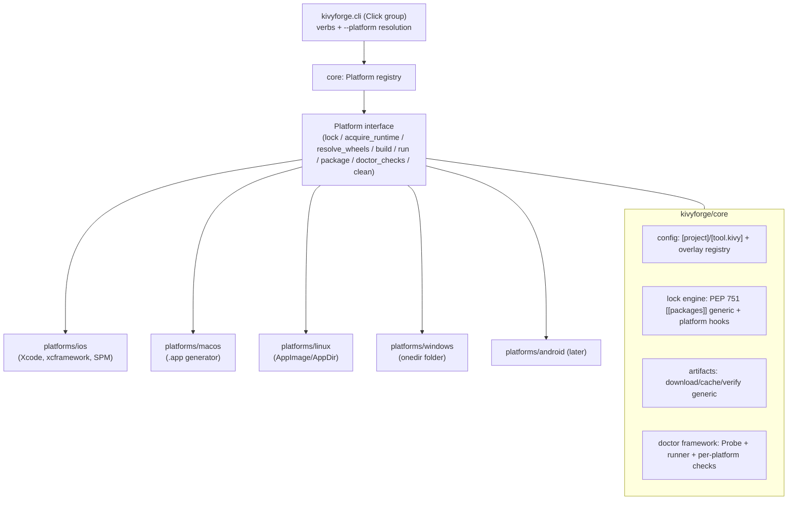

# 05 — Platform Architecture

kivyforge is organized as a shared **core** plus one **platform backend** per target, sitting behind a `Platform` interface and a registry. The core owns everything that is the same across platforms (config parsing, the PEP 751 lock engine, artifact download/cache/verify, the doctor framework, the CLI and platform-resolution chain); each backend supplies only what is genuinely platform-specific.

## `core` responsibilities

- **`core/config`** — parse the shared `[project]` + `[tool.kivy]` tables; each platform backend registers an overlay parser + config dataclass. `Config` holds `project`, `kivy`, and `platforms: dict[str, PlatformConfig]`. A `load_config(require_platform=...)` entry point validates the shared tables plus the requested overlay.
- **`core/lock`** — generic PEP 751 `[[packages]]` resolve/read/write; platform backends supply platform-tag selection, runtime metadata, and any extension subtables. The lockfile is named `pylock.<platform>.toml` with a single `[tool.kivyforge]` extension table (platform identified by filename; see [03 — lockfile concept](03-lockfile-concept.md)).
- **`core/artifacts`** — generic download / cache / verify (SHA-256). The cache dir is platform-appropriate for the *host* running kivyforge (e.g. `~/Library/Caches/kivyforge/` on macOS).
- **`core/doctor`** — a probe + runner framework; backends contribute their own checks (including host-capability checks for the target).
- **`core/cli`** — the Click group, verb dispatch, and the `--platform` → `KIVYFORGE_PLATFORM` → host resolution chain; verbs delegate to the resolved backend (see [02 — CLI + platform resolution](02-cli-and-platform-resolution.md)).

### Realized module layout

The conceptual `core/*` groupings above live at the top level of the package:
`kivyforge/config`, `kivyforge/lock` (the shared wheel+runtime engine and neutral
lock model/reader/resolver helpers), `kivyforge/artifacts`, `kivyforge/doctor`
(`probe`, `result`, `checks_common`), and `kivyforge/cli`. Everything
platform-specific is consolidated under one self-contained package per target at
`kivyforge/platforms/<name>/`:

- `__init__.py` — the `Platform` subclass (metadata + host capability + the
  `build`/`run`/`package`/`open_project`/`doctor` verb methods, each lazily
  importing the modules below to keep backend import cheap and cycle-free).
- bundler modules — the native project/artifact generator.
- `lock/` — the platform's lock profile over the shared engine (desktop) or the
  carved-out iOS lock stack.
- `cli.py` — the verb implementations the backend dispatches to.
- `doctor.py` — the platform checks plus its `<name>_doctor` orchestration,
  reusing `kivyforge/doctor/checks_common.py`.

## The `Platform` interface

A backend implements a common interface; the exact method set evolves with the codebase, but conceptually a backend provides:

| Capability | Responsibility |
|------------|----------------|
| overlay parsing | register the `[tool.kivy.<platform>]` schema + config dataclass and its validation |
| `acquire_runtime` | pin/download the platform's prebuilt Python runtime |
| `resolve_wheels` | supply platform tags + resolution rules for the lock engine |
| `lock` extensions | contribute any platform-native pins to `[tool.kivyforge]` |
| `build` | materialize the native project from the lock |
| `run` | install/launch on device / simulator-emulator / host |
| `package` | produce (and sign) the runnable artifact; declare its `-f` formats |
| `doctor_checks` | environment + host-capability + project checks |
| `clean` | remove generated artifacts |

The **registry** maps a platform name (`ios`, `macos`, …) to its backend and is the single source of truth for `click.Choice` validation of `--platform`, for host-platform detection, and for "which platforms are configured in this `pyproject.toml`."

## How to add a platform

Adding a platform is additive and localized:

1. Create the self-contained `kivyforge/platforms/<name>/` package (backend `__init__.py`, bundler modules, `lock/`, `cli.py`, `doctor.py`) and register the backend in the registry.
2. Define the `[tool.kivy.<name>]` overlay schema + config dataclass (reuse shared `[tool.kivy]` keys; add only what's platform-specific).
3. Implement runtime acquisition and wheel-tag selection so `core/lock` can emit `pylock.<name>.toml`.
4. Implement the native-project generation + `build` / `run` / `package` (with its `-f` formats) and signing of the runnable artifact.
5. Contribute `doctor` checks, including the host-capability check for the target.
6. Add examples and docs (a `[tool.kivy.<name>]` overlay doc, a `pylock.<name>.toml` schema doc as needed).

The shared `[project]` / `[tool.kivy]` contract and the PEP 751 + `[tool.kivyforge]` lock pattern mean a new platform slots in without changing the cross-platform surface: existing projects add one overlay and gain a new committed lock.

## Example: the iOS backend

`platforms/ios` provides the Xcode project generator, the iOS config overlay, iOS lock specifics (PEP 730 tags, the `Python.xcframework` runtime pin, SPM and `.xcframework` native channels), iOS artifact specifics (per-slice wheels, wheel-embedded xcframeworks), and iOS doctor checks. See the [iOS design docs](../platforms/ios/pyproject-ios.md) for the full backend.
