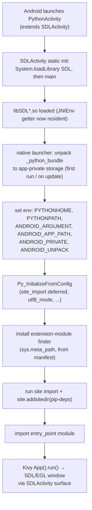

# Android — Bootstrap Design

> **Status: design.** The Android analog of the iOS [`main.m` embedding
> bootstrap](../ios/05-xcode-project-generation.md#mainm--python-embedding-bootstrap)
> and the Windows [bootloader](../windows/bootloader-windows.md). This is the
> load-bearing document for the pyjnius/SDL runtime contract worked out in the
> pyjnius Android-wheel spike — see the
> [spike findings](../../dev/pyjnius-android-wheel-spike-findings.md) (evidence)
> and the [pre-spike brief](../../dev/pyjnius-android-wheel-spike.md). The
> first-party PyPI wheel, the SDL3-host run, and first-party (kivyforge-stack)
> validation are still open; the runtime contract below reflects the spike's
> findings and prototype, not a shipped release.

The bootstrap is how a launched Android app **starts the JVM-hosted process,
loads native libraries in the right order, initializes the embedded CPython
interpreter, and hands control to the user's Python entry point** — while
satisfying the residual runtime contract the prebuilt pyjnius wheel depends on.

kivyforge **owns** the bootstrap. It is a set of generated Java templates under
`org.kivy.android.*` / `org.libsdl.app.*` / `org.jnius.*` plus a native-launcher C
template (`app/src/main/cpp/`), emitted per project by `kivyforge build`. The
app's own Gradle compiles and dexes the Java and, via AGP `externalNativeBuild` +
the NDK, compiles the native launcher (`libmain.so`) per ABI — the analog of
Xcode compiling iOS's `main.m` (see [gradle-project-generation §"The native
launcher"](04-gradle-project-generation.md#the-native-launcher-libmainso)). It is informed by python-for-android's proven bootstrap but is
kivyforge-maintained and versioned with the pyjnius wheel contract (below); it is
**not** a dependency on p4a or on any community bootstrap.

## Why the bootstrap is kivyforge-owned

The pyjnius spike deliberately narrowed the wheel's scope: the pyjnius wheel is
**Java-free** and **SDL-agnostic**, resolving the JVM `JNIEnv` at runtime. That
choice moves two responsibilities to the host bootstrap, and there is exactly one
place in the kivyforge stack that can own them coherently:

- **The Java glue** (`org.jnius.NativeInvocationHandler`) that pyjnius needs to implement Java interfaces from Python. A `.whl` carries no `.dex`, and a class in site-packages is not on ART's classpath, so the wheel cannot deliver it. The bootstrap generates it as a Java source that Gradle compiles into the APK.
- **The SDL load order** — `libSDL2.so`/`libSDL3.so` must be loaded, with the SDL `JNIEnv` getter reachable, before the first `import jnius`.

Owning the bootstrap (rather than vendoring p4a's or depending on `ksp-bootstraps`)
keeps the `invoke0` native-method contract and its matched Java class in one
repository, under one version, next to the code that pins the pyjnius wheel.

## Namespace preservation: `org.kivy.android.*`

The generated Activity/service classes keep the **`org.kivy.android.*`** package
names (`org.kivy.android.PythonActivity`, `org.kivy.android.PythonService`, …).
This is not cosmetic: Kivy, Plyer, and app code reach Android APIs via
`autoclass('org.kivy.android.PythonActivity')` and friends. Preserving the
namespace means that entire body of existing Kivy-Android Python code works
unmodified. Likewise the SDL Java glue keeps `org.libsdl.app.*`, and the pyjnius
glue keeps `org.jnius.NativeInvocationHandler` (the class name pyjnius resolves at
proxy-creation time).

## Launch sequence

1. **Android starts `org.kivy.android.PythonActivity`** (the `LAUNCHER` activity), which extends `org.libsdl.app.SDLActivity`.
2. **`SDLActivity` static initialization loads the native libraries** via `System.loadLibrary(...)` in the required order: the SDL family (`SDL2` or `SDL3` + `SDL2_image`/`_mixer`/`_ttf` as present), then `libpython3.x.so`, then the bootstrap's `libmain.so`. Because SDL is loaded here **before any Python runs**, its `JNIEnv` getter (`SDL_AndroidGetJNIEnv` for SDL2 / `SDL_GetAndroidJNIEnv` for SDL3) is resident in the process.
3. **The native launcher (`libmain.so`) unpacks the Python asset bundle** (`assets/_python_bundle/`) to app-private storage on first run (and after an update, keyed by a version stamp), since Python source must live on a real filesystem path. `libmain.so` is kivyforge's own C shim, compiled from the emitted `cpp/` sources by the NDK during the Gradle build (see [gradle-project-generation §"The native launcher"](04-gradle-project-generation.md#the-native-launcher-libmainso)).
4. **It sets the environment** the runtime and pyjnius expect (below), then initializes CPython via `Py_InitializeFromConfig` with **`site_import` deferred** — so no `lib-dynload` extension is loaded before the finder is in place (core start-up needs only the modules built into `libpython`).
5. **It installs the extension-module finder** on `sys.meta_path` from the bundle's manifest, then runs `import site` and registers `pip-deps` as a site directory (`site.addsitedir()`, not bare `PYTHONPATH`) so `.pth` files work — the same asymmetry the iOS bootstrap documents. See "Extension-module finder" below.
6. **It imports the entry-point module** (`PyImport_ImportModule(entry_point)`), consistent with the [common bootstrap contract](../../common/01-pyproject-kivy-spec.md) (entry point is *imported*, not run as `__main__`). Kivy's `App().run()` drives the SDL surface `SDLActivity` created.

## The environment contract

The launcher sets, before `Py_InitializeFromConfig`:

| Variable | Value | Why |
|----------|-------|-----|
| `PYTHONHOME` | the unpacked bundle root | Locates the stdlib. |
| `PYTHONPATH` | `<bundle>/stdlib` : `<bundle>/app` | Stdlib + user app code (`app_dir`); the stdlib entry is deliberate belt-and-suspenders alongside `PYTHONHOME`. `pip-deps` is added via `site.addsitedir()` instead. |
| `ANDROID_ARGUMENT` | the unpacked app directory | **Load-bearing for pyjnius**: gates pyjnius's upstream `threading.Thread.run` wrapper that calls `jnius.detach()` on thread exit (correct JNI hygiene). Also how `kivy.utils.platform` detects Android. |
| `ANDROID_APP_PATH` | the app directory | App code root, per the Kivy-Android convention. |
| `ANDROID_PRIVATE` | app-private storage dir | Writable per-app path. |
| `ANDROID_UNPACK` | unpack root | Where the bundle was extracted. |

`Py_PreConfig`/`Py_InitializeFromConfig` are configured analogously to iOS:
`utf8_mode = 1`, `buffered_stdio = 0`, `use_system_logger = 1` (routes
`stdout`/`stderr` to logcat), `install_signal_handlers = 1`. `site_import` is set
to `0` so the finder (below) is in place before any dynamically-loaded extension
module is imported; the launcher then runs `import site` explicitly.

## Extension-module finder

Android exposes native libraries only from a **single flat directory**
(`nativeLibraryDir`), but Python extension modules are imported by dotted name
from nested site-packages paths. The bootstrap reconciles this the same way iOS
does with `.fwork`/`AppleFrameworkLoader`:

- **Build side.** Every extension `.so` — stdlib `lib-dynload` and wheel extensions alike — is flattened into `jniLibs/<abi>/` under a deterministic, collision-free filename, and the mapping `dotted-module → filename` is written to a manifest shipped in the (ABI-independent) asset bundle. Shared libraries resolved by soname (SDL, `libpython`, `lib*_python.so`, Kivy's `.libs/`) are *not* renamed. See [gradle-project-generation §"Native libraries and the `.so` load model"](04-gradle-project-generation.md#native-libraries-and-the-so-load-model).
- **Runtime side.** The bootstrap reads the manifest and installs a `sys.meta_path` finder whose loader is a stock `importlib.machinery.ExtensionFileLoader` pointed at `nativeLibraryDir/<filename>`. Because every extension is `dlopen`'d from `nativeLibraryDir`, its `DT_NEEDED` shared-library dependencies resolve from that same directory via the linker's default search path — no `rpath`, no `LD_LIBRARY_PATH`.
- **Ordering.** The finder is installed immediately after `Py_InitializeFromConfig` and before `import site`, so the first dynamically-loaded extension already resolves through it. Modules built into `libpython` (the interpreter core) need no finder and load during init as usual.

This is what keeps the Python asset bundle pure-Python and identical across ABIs
(only the `.so` bytes under `jniLibs/<abi>/` differ), which is what lets a single
bundle back a multi-ABI `.aab`.

## SDL generation and the pyjnius contract

The pyjnius Android wheel (as characterized by the spike's findings) is **one
universal artifact** across SDL generations. Its `.so`:

- carries **no `DT_NEEDED`** on any `libSDL*.so` (verified at the ELF level), so it `dlopen`s successfully regardless of which SDL the host loaded; and
- resolves the JVM `JNIEnv` at import time via a **three-tier runtime resolver**, each tier `dlopen`ing the library by soname and `dlsym`ing the handle (because a CPython extension `dlopen`'d from site-packages does **not** see the host's `System.loadLibrary`'d symbols via `RTLD_DEFAULT` — an empirically settled correction; [findings, Steps 3–4](../../dev/pyjnius-android-wheel-spike-findings.md)):
  1. `SDL_GetAndroidJNIEnv` from `libSDL3.so` (SDL3),
  2. `SDL_AndroidGetJNIEnv` from `libSDL2.so` (SDL2),
  3. `JNI_GetCreatedJavaVMs` from `libnativehelper.so` + `AttachCurrentThread` (SDL-independent, best-effort API 31+).

So the bootstrap's only obligations for the `JNIEnv` are: **load the SDL matching
`[tool.kivy.android].kivy_generation` before Python imports run** (step 2 above),
so tier 1 or tier 2 resolves. `kivy_generation = 2` → the SDL2 glue + `libSDL2.so`;
`kivy_generation = 3` → SDL3.

> **Kivy is SDL2 today.** The spike's prototype exercised SDL2 (tier 2) on an
> x86_64 emulator and on arm64 hardware (Pixel 8a, Android 16 —
> [findings, Steps 4 & 7](../../dev/pyjnius-android-wheel-spike-findings.md));
> the SDL3 tier-1 path is identical by construction but not yet exercised
> (Kivy 3.0 lands the SDL3 host). Both are first-class in the schema. Full
> first-party validation under the kivyforge stack, across ABIs and both SDL
> generations, remains open — the spike's runs used a p4a test harness.

### The `NativeInvocationHandler` matched pair

`org.jnius.NativeInvocationHandler.java` is a kivyforge bootstrap template,
generated and dexed like `PythonActivity.java`. Its `invoke0` native method and
the pyjnius wheel's `invoke0` implementation are a **matched pair that must move
together**. Because the wheel ships no Java, nothing links them at compile time,
so kivyforge enforces the pairing explicitly:

- **Hard build gate (not a warning).** The bootstrap template and the pinned pyjnius wheel both carry a compatibility marker. `kivyforge build` **fails** — and `kivyforge doctor` reports **FAIL** — when the locked `pyjnius` version falls outside the template's declared compatible range. The `invoke0` native-method signature is an ABI contract; a mismatch is a guaranteed runtime crash, never something to ship. The fix is to re-lock to a compatible `pyjnius` or update kivyforge for a newer template.
- Even so, pyjnius resolves `autoclass('org.jnius.NativeInvocationHandler')` at proxy-creation, so any residual mismatch that slipped through still surfaces as a clear `ClassNotFound`/`NoSuchMethodError` at first use — not silent corruption.

> **Implementation status.** The wheel-side half of this marker does not exist
> yet: the spike wheel carries only a version comment, and the findings note
> "nothing enforces it once packaging is out of the loop"
> ([findings, "Java-glue delivery"](../../dev/pyjnius-android-wheel-spike-findings.md)).
> Adding a machine-readable compatibility marker to the pyjnius wheel build, and
> declaring the matching range in the bootstrap template, is an open work item
> for the first Android backend release.

The supported `invoke0` ranges per bootstrap-template version, alongside the
CPython/Kivy/SDL/ABI/minSdk combinations they pair with, are tabulated in the
[compatibility matrix](08-compatibility-matrix.md).

The spike's prototype demonstrated this
([findings, Step 5](../../dev/pyjnius-android-wheel-spike-findings.md)):
`PythonJavaClass`/`@java_method` proxies (`Comparator`, `Runnable`) fired
`invoke0` with the glue delivered app-side (the bootstrap-template model), not
from the wheel.

> **pyjnius sharp edge (app-facing).** The spike harness first drove its proxy
> via `Thread(runnable)` and hit a CheckJNI abort: pyjnius overload resolution
> picked `Thread(String)` and passed the proxy as a String. The fix is an
> unambiguous overload (the harness switched to `FutureTask(Runnable, V)`).
> This is a pyjnius behavior, not a wheel/glue/bootstrap issue — but it belongs
> in kivyforge's user-facing docs, per the spike's own note
> ([findings, Step 5 gotcha](../../dev/pyjnius-android-wheel-spike-findings.md)).

### No `JNI_CreateJavaVM`; attach to the host VM

pyjnius on Android **attaches to the process's existing JVM** (the one ART
provides); it never calls `JNI_CreateJavaVM` (`jnius_config.vm_running` stays
`False` — [findings, Step 6](../../dev/pyjnius-android-wheel-spike-findings.md)). The bootstrap must not attempt to create a VM —
the VM already exists because the app *is* a JVM process. `JNI_OnLoad` inside the
wheel is deliberately **not** used: ART only calls `JNI_OnLoad` for libraries
loaded via `System.loadLibrary`, and the wheel's `.so` is `dlopen`'d by CPython on
`import`, so any `JNI_OnLoad` there would be dead code.

## Fail loudly

Per the pyjnius contract, a missing JVM/glue must raise a **clear error**, not a
cryptic `dlopen`/symbol failure:

- If none of the three `JNIEnv` tiers resolves, pyjnius raises a `RuntimeError`/`ImportError` naming the host contract ("needs a host that provides an in-process JVM; ensure SDL is loaded before `import jnius`").
- The bootstrap logs the native-library load order to logcat, so a load-order regression is diagnosable.
- `kivyforge doctor` checks that the bootstrap's SDL generation matches `[tool.kivy.android].kivy_generation` and the resolved Kivy version.

## Process and thread lifecycle

- **Thread detach.** pyjnius's upstream `ANDROID_ARGUMENT`-gated `threading.Thread.run` wrapper calls `jnius.detach()` on worker-thread exit; the bootstrap sets `ANDROID_ARGUMENT`, so this works for free ([findings, Step 6](../../dev/pyjnius-android-wheel-spike-findings.md)). Do not reimplement.
- **Activity lifecycle.** `SDLActivity` handles pause/resume/surface changes; the bootstrap forwards them to Kivy's Android hooks. The OS may kill a backgrounded process at will — decide and document any state persistence in the app, not the bootstrap (the "OS may kill/restart" degradation policy the [Windows retrospective](../../dev/windows-backend-retrospective.md) flags).
- **Services.** `[tool.kivy.android.services]` entries generate `org.kivy.android.PythonService` subclasses that run a named `entry_point` in a separate process, reusing the same bundle-unpack + interpreter-init path. A **foreground** service is generated with its declared `foreground_service_type` and, on start, creates the notification channel and calls `startForeground()` with the configured `notification` (channel/title/text) — mandatory on Android 14+ or the OS kills the service — and the matching `FOREGROUND_SERVICE_<TYPE>` permission is added to the manifest. The running Python can replace the notification later via pyjnius.

## Contract smoke-test hook

To back the required release smoke gate (see [cli-android §`--smoke`](06-cli-android.md#--smoke-the-contract-smoke-test)), the bootstrap exposes a **self-test entry** the generated instrumented test drives. On a test-only launch signal it:

- imports a known native extension module through the `sys.meta_path` finder (exercising the flattened-`.so` mechanism), and
- constructs a `PythonJavaClass`/`@java_method` proxy (`Runnable`) and lets Java invoke it, asserting `invoke0` fires,

then reports pass/fail back to the instrumentation. This exercises the two novel,
load-bearing mechanisms — the extension-module finder and the `invoke0` glue —
**on-device, without any app-specific test code**. The hook is inert in a normal
launch (it responds only to the instrumentation's test intent), so it adds no
attack surface or startup cost to a shipped app.

## Relationship to the iOS bootstrap

| Concern | iOS (`main.m`) | Android (this doc) |
|---------|----------------|--------------------|
| Entry Activity/host | `UIApplicationMain` | `PythonActivity extends SDLActivity` |
| Native runtime layout | `install_python` → per-module `.framework` + `.fwork` | python.org embeddable layout → `jniLibs/<abi>/` + asset bundle |
| Python bundle | in-bundle `python/` | asset unpacked to app-private storage on first run |
| Entry point | `PyImport_ImportModule` | `PyImport_ImportModule` (same) |
| site dir | `site.addsitedir(pip-deps)` | `site.addsitedir(pip-deps)` (same) |
| Native bridge | pyobjus (dynamic, no glue) | pyjnius (needs SDL-loaded `JNIEnv` + `NativeInvocationHandler` glue) |

The Android bootstrap carries more responsibility than iOS's precisely because of
the JVM bridge — which is why it is a first-class, kivyforge-owned, versioned
component rather than a generated stub.
