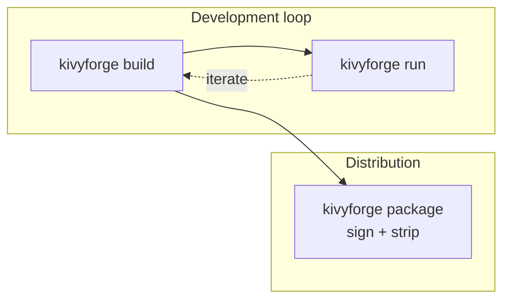

# Build versus package

kivyforge has two verbs that produce output, and they serve different purposes:
`build` for day-to-day development, and `package` for the artifact you ship.

## `build`: the development loop

`kivyforge build` downloads the runtime and pinned artifacts and generates the
native project for the target. It gets your app to a state you can open in an
IDE, launch on a simulator, or run on the host. It does not sign for
distribution, and it keeps your Python source readable, so iteration stays
quick.

`kivyforge run` builds (unless you pass `--no-build`) and then launches the app.

## `package`: the distributable

`kivyforge package` produces the finished, distributable artifact and signs it.
Signing has to operate on the bundled binaries, so it happens inside kivyforge
rather than afterward. What signing means depends on the platform:

- **iOS** and **Android**: `package` requires signing to be configured.
- **macOS**: Developer ID signing when you configure it, otherwise an ad-hoc
  signature.
- **Windows**: Authenticode signing when you configure it, otherwise unsigned.
- **Linux**: not signed.

When `package` falls back to ad-hoc or unsigned, it reports a
`KF-SIGNING-UNCONFIGURED` warning. By default, `package` also byte-compiles
your app's Python and strips the source; `build` does neither.

## The `-f` format selector

`package -f FORMAT` chooses the artifact shape where a platform offers more
than one. Without `-f`, `package` uses the platform's default:

| Platform | Formats | Default |
|---|---|---|
| `ios` | `ipa` | `ipa` |
| `macos` | `app` (a `.app` bundle) | `app` |
| `windows` | `folder` (an onedir folder with a launcher `.exe`) | `folder` |
| `linux` | `appimage` (a single `.AppImage` file), `folder` (an AppDir) | `appimage` |
| `android` | `apk`, `aab` | `apk` |

## The installer boundary

kivyforge builds and signs the runnable artifact, and stops there. Wrapping that
artifact in an installer or container is out of scope; use a dedicated tool:

- macOS `.dmg`: [create-dmg](https://github.com/create-dmg/create-dmg) or similar.
- Windows installer: [Inno Setup](https://jrsoftware.org/isinfo.php), WiX, or NSIS.
- Linux `.deb`, `.rpm`, or Flatpak: your distribution's own tooling.
- App Store or Google Play submission: the store's upload tools.

## What's next

- [Package a .dmg](../guides/macos/dmg.md) or
  [create a Windows installer](../guides/windows/installer.md).
- [JSON output](../reference/json-output.md): read `data.artifacts` to find what a
  run produced.
- [CLI reference](../reference/cli.md).
