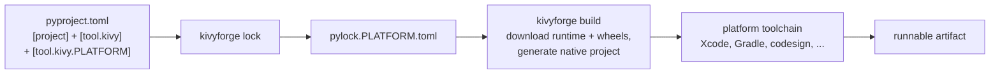

# How kivyforge works

kivyforge turns one declarative project file into a runnable app for a target
platform. Every platform follows the same four stages. Only the backend that
implements each stage differs.

## The four stages

### 1. Declare

You write one `pyproject.toml`. It holds standard [PEP 621](https://peps.python.org/pep-0621/)
`[project]` metadata, cross-platform Kivy settings in `[tool.kivy]`, and one
additive `[tool.kivy.<platform>]` overlay per target. Any PEP 621 tool can read
the file. See [Project configuration](configuration.md).

### 2. Lock

`kivyforge lock` resolves `[project].dependencies` for the target, evaluates
[PEP 508](https://peps.python.org/pep-0508/) environment markers, selects the
platform-tagged wheels, and writes `pylock.<platform>.toml` pinned by URL and
SHA-256. The filename identifies the platform; no field inside the file does.
See [Lockfiles](lockfiles.md).

### 3. Build

`kivyforge build` downloads the prebuilt Python runtime and the pinned wheels,
then generates the platform's native project: an Xcode project for iOS, a Gradle
project for Android, or a bundled app folder for macOS, Linux, and Windows.

### 4. Produce

The platform's own toolchain compiles, signs, and emits the artifact: Xcode for
iOS, Gradle for Android, and `codesign`, `appimagetool`, or `signtool` on the
desktop. kivyforge drives these tools; it does not replace them. See
[Build versus package](build-vs-package.md).

## Design principles that shape the workflow

- **One declarative source of truth.** All cross-platform metadata lives in
  `[project]` and `[tool.kivy]`, and each target adds an overlay. There is no
  separate spec file.
- **Reproducible per-platform locks.** Each target gets its own lockfile,
  pinned by hash, so a build is repeatable.
- **Consume prebuilt artifacts.** kivyforge never builds Python or C extensions
  from source. It uses prebuilt runtimes and platform-tagged wheels, and leaves
  any real compilation to the platform toolchain. See
  [Prebuilt runtimes and wheels](runtimes-and-wheels.md).
- **Build and sign the artifact; leave the installer to other tools.**
  kivyforge produces and signs the runnable artifact. Wrapping it in a `.dmg`,
  an MSI, or a `.deb` is a job for dedicated tools.
- **A uniform, explicit CLI.** The same verbs work on every platform, with one
  `--platform` selector. See [Choose a target platform](choose-platform.md).

## What's next

- [Project configuration](configuration.md)
- [Lockfiles](lockfiles.md)
- [Build versus package](build-vs-package.md)
