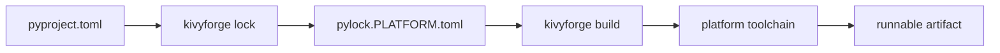

# kivyforge

kivyforge is a declarative, [PEP 621](https://peps.python.org/pep-0621/)-aligned
build toolchain for [Kivy](https://kivy.org) (and other Python) apps. You
describe your app once in `pyproject.toml`. kivyforge resolves your dependencies
into a per-platform lockfile, downloads prebuilt runtimes and wheels, generates a
native project, and drives the platform's own toolchain to produce a runnable
artifact.

kivyforge is the successor to **kivy-ios**, **python-for-android**, and
**buildozer**. One toolchain and one configuration file target every platform
Kivy runs on: **Android, iOS, Linux, macOS, and Windows**.

- :material-rocket-launch: **New here?**

    Install the tool, then build your first app.

    [Install kivyforge](get-started/install.md) ·
    [Desktop quickstart](get-started/quickstart-desktop.md)

- :material-lightbulb: **Understand the model**

    Four stages: declare, lock, build, produce.

    [How kivyforge works](concepts/how-it-works.md)

- :material-cellphone-cog: **Ship to a platform**

    Task guides for each target.

    [Android](guides/android/configure.md) ·
    [iOS](guides/ios/configure.md) ·
    [macOS](guides/macos/build.md) ·
    [Windows](guides/windows/build.md) ·
    [Linux](guides/linux/build.md)

- :material-book-open-variant: **Look something up**

    Commands, config keys, and codes.

    [CLI](reference/cli.md) · [pyproject.toml](reference/pyproject/tool-kivy.md)

## The core model

Every platform follows the same four-stage pipeline. Only the backend that
implements each stage differs.

1. **Declare** your app in one `pyproject.toml`: standard `[project]` metadata,
   shared `[tool.kivy]` settings, and one `[tool.kivy.<platform>]` overlay per
   target.
2. **Lock** with `kivyforge lock`: resolve dependencies for the target and write
   a `pylock.<platform>.toml` pinned by URL and SHA-256.
3. **Build** with `kivyforge build`: download the runtime and wheels, then
   generate the native project.
4. **Produce** the distributable with `kivyforge package`, which drives the
   platform's own toolchain and signs the result where the platform supports it.

## Supported targets

This table matches the output of `kivyforge capabilities`.

| Target (`-p`) | Architectures | Package formats (`-f`) | Build host |
|---|---|---|---|
| `ios` | `arm64` | `ipa` | macOS with Xcode |
| `macos` | `arm64` | `app` | macOS |
| `linux` | `aarch64`, `x86_64` | `appimage` (default), `folder` | Linux |
| `windows` | `amd64` | `folder` | Windows |
| `android` | `arm64_v8a`, `x86_64` | `apk` (default), `aab` | Windows, macOS, or Linux |

Apple targets are Apple Silicon (`arm64`) only. For the generated host matrix,
see [Which host builds which target](get-started/hosts.md).

!!! note "Early development"
    kivyforge is alpha software. Configuration keys and command options can
    still change between releases. The [release notes](release-notes.md) list
    each change.

## What's next

- [Install kivyforge](get-started/install.md)
- [Build a desktop app](get-started/quickstart-desktop.md)
- [How kivyforge works](concepts/how-it-works.md)
